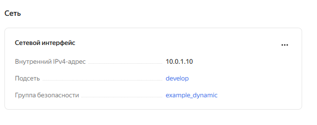
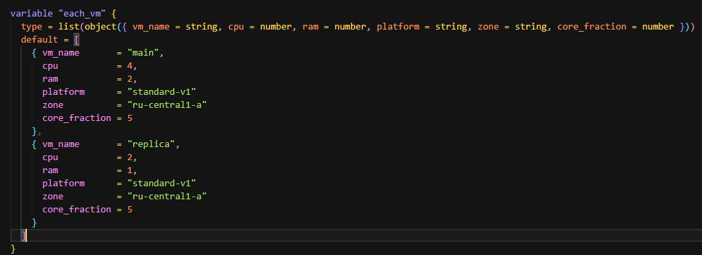

## Задача 1

>Ответ: входящие правила «Группы безопасности» в ЛК Yandex Cloud.


## Задача 2

1. Создайте файл count-vm.tf. Опишите в нём создание двух одинаковых ВМ web-1 и web-2 (не web-0 и web-1) с минимальными параметрами, используя мета-аргумент count loop. Назначьте ВМ созданную в первом задании группу безопасности.(как это сделать узнайте в документации провайдера yandex/compute_instance )




2. Создайте файл for_each-vm.tf. Опишите в нём создание двух ВМ для баз данных с именами "main" и "replica" разных по cpu/ram/disk_volume , используя мета-аргумент for_each loop. Используйте для обеих ВМ одну общую переменную типа:

```
variable "each_vm" {
  type = list(object({  vm_name=string, cpu=number, ram=number, disk_volume=number }))
}
```



ВМ из пункта 2.1 должны создаваться после создания ВМ из пункта 2.2.


Используйте функцию file в local-переменной для считывания ключа ~/.ssh/id_rsa.pub и его последующего использования в блоке metadata, взятому из ДЗ 2. 6.


Инициализируйте проект, выполните код.
