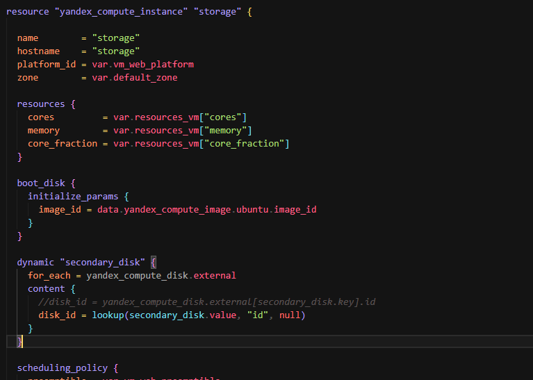

## Задача 1

>Ответ: входящие правила «Группы безопасности» в ЛК Yandex Cloud.


## Задача 2

1. Создайте файл count-vm.tf. Опишите в нём создание двух одинаковых ВМ web-1 и web-2 (не web-0 и web-1) с минимальными параметрами, используя мета-аргумент count loop. Назначьте ВМ созданную в первом задании группу безопасности.(как это сделать узнайте в документации провайдера yandex/compute_instance )


2. Создайте файл for_each-vm.tf. Опишите в нём создание двух ВМ для баз данных с именами "main" и "replica" разных по cpu/ram/disk_volume , используя мета-аргумент for_each loop. Используйте для обеих ВМ одну общую переменную типа:

```
variable "each_vm" {
  type = list(object({  vm_name=string, cpu=number, ram=number, disk_volume=number }))
}
```


ВМ из пункта 2.1 должны создаваться после создания ВМ из пункта 2.2.


Используйте функцию file в local-переменной для считывания ключа ~/.ssh/id_rsa.pub и его последующего использования в блоке metadata, взятому из ДЗ 2. 6.


Инициализируйте проект, выполните код.


## Задача 3

1. Создайте 3 одинаковых виртуальных диска размером 1 Гб с помощью ресурса yandex_compute_disk и мета-аргумента count в файле disk_vm.tf.


2. Создайте в том же файле одиночную(использовать count или for_each запрещено из-за задания №4) ВМ c именем "storage" . Используйте блок dynamic secondary_disk{..} и мета-аргумент for_each для подключения созданных вами дополнительных дисков.




## Задача 4

1. В файле ansible.tf создайте inventory-файл для ansible.


2. Инвентарь должен содержать 3 группы и быть динамическим
3. Добавьте в инвентарь переменную fqdn.


4. Выполните код. Приложите скриншот получившегося файла.


## Задача 5*

1. Напишите output, который отобразит ВМ из ваших ресурсов count и for_each в виде списка словарей. Приложите скриншот вывода команды terrafrom output.


## Задача 6*

1. Используя null_resource и local-exec, примените ansible-playbook к ВМ из ansible inventory-файла. Готовый код возьмите из демонстрации к лекции. Для зачёта предоставьте код вместе с основной частью задания.

>Ответ: код находится в файлах [ansible.tf](./src/ansible.tf) и [test.yml](./src/test.yml)

## Задача 7*

## Задача 8*

Идентифицируйте и устраните намеренно допущенную в tpl-шаблоне ошибку. Обратите внимание, что terraform сам сообщит на какой строке и в какой позиции ошибка!
```
[webservers]
%{~ for i in webservers ~}
${i["name"]} ansible_host=${i["network_interface"][0]["nat_ip_address"] platform_id=${i["platform_id "]}}
%{~ endfor ~}
```

>Ответ: ошибок три. Первая - отсутствует закрывающая скобка в переменной `${i["network_interface"][0]["nat_ip_address"]`
>Вторая ошибка - пробел в переменной `${i["platform_id "]`
>Третья ошибка - лишняя закрывающая скобка в переменной `${i["platform_id "]}}`. Правильно должно быть так


